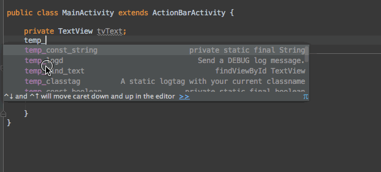

# Android Studio Live Templates

A collection of Android Studio Live Templates for Android development.

### Android.xml
- **`temp_classtag`**: "A static logtag with your current classname"
- **`temp_const_boolean`**: "private static final boolean"
- **`temp_const_int`**: "private static final int"
- **`temp_const_long`**: "private static final long"
- **`temp_const_string`**: "private static final String"
- **`temp_find_button`**: "findViewById Button"
- **`temp_find_edit`**: "findViewById EditText" 
- **`temp_find_image`**: "findViewById ImageView"
- **`temp_find_list`**: "findViewById ListView"
- **`temp_find_progress`**: "findViewById ProgressBar"
- **`temp_find_text`**: "findViewById TextView"
- **`temp_foreach`**: "Create a for each loop"
- **`temp_handler`**: "Create a new handler object"
- **`temp_handlerpost`**: "Implement handler post method"
- **`temp_inflate`**: "Create layoutinflater and inflate view"
- **`temp_logd`**: "Send a DEBUG log message"
- **`temp_loge`**: "Send an Error log message"
- **`temp_logi`**: "Send an INFO log message"
- **`temp_logv`**: "Send a VERBOSE log message"
- **`temp_logw`**: "Send a WARN log message"
- **`temp_new_activity`**: "Start a new activity"
- **`temp_parcelable`**: "Create a parcelable block for your current class"
- **`temp_path_assets`**: "Assets directory path"
- **`temp_psf`**: "private static final variable with type and member"
- **`temp_psfb`**: "private static final boolean"
- **`temp_psfi`**: "private static final int"
- **`temp_psfs`**: "private static final String"
- **`temp_res_drawable`**: "resources.getDrawable(...)"
- **`temp_res_string`**: "resources.getString(...)"
- **`temp_res_color`**: "resources.getColor(...)"
- **`temp_runui`**: "runOnUIThread"
- **`temp_toast`**: "Create a new Toast message"
- **`temp_newinstance`**: "Create a new Fragment instance with arguments"
- **`temp_key`**: "Key variable for preferences, bundles...
- **`temp_calendar`**: "Get a current Calendar"
- **`temp_listener`**: "Observer Design Pattern (Listener)"
- **`temp_porterduff`**: "A color filter that can be used to tint a drawable"
- **`temp_attrs`**: "Retrieve XML attributes with style and theme information applied"

Installation
------------

 * OPTION 1
 
 
    1. Download `Android.xml`
    2. Save it to `~/Library/Preferences/AndroidStudio/templates`
    3. Restart Android Studio if it's running
    4. Now, you can write `'temp_...'`

 * OPTION 2

    1. Clone / Download the proyect.
    2. Run the `install.sh` script.
    3. Restart Android Studio if it's running
    4. Now, you can write `'temp_...'`

##Contribution
1. Fork
2. Add your own live templates
3. Send me a pull request

Author
-------

David Pizarro (dpizarro89@gmail.com)

License
-------

    Copyright 2015 David Pizarro

    Licensed under the Apache License, Version 2.0 (the "License");
    you may not use this file except in compliance with the License.
    You may obtain a copy of the License at

       http://www.apache.org/licenses/LICENSE-2.0

    Unless required by applicable law or agreed to in writing, software
    distributed under the License is distributed on an "AS IS" BASIS,
    WITHOUT WARRANTIES OR CONDITIONS OF ANY KIND, either express or implied.
    See the License for the specific language governing permissions and
    limitations under the License.

---
